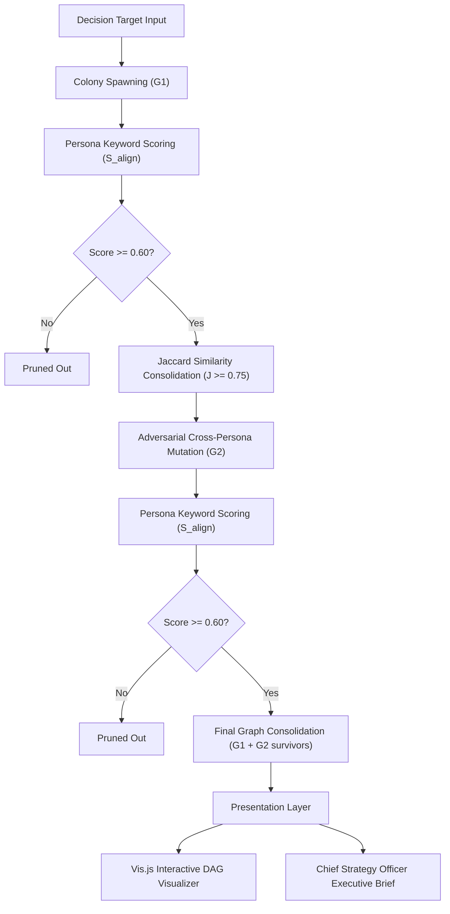

# Evolutionary Consequence Engine (TinyLlama Prototype)

An experimental reasoning engine exploring massively parallel hypothesis generation, cognitive-style alignment culling, Jaccard token consolidations, and cross-persona mutation layers running entirely on local CPU hardware.

---

## 🗺️ System Architecture Workflow



---

## 📂 Repository File Blueprint

- **`config.json`**: Holds global hyperparameter registers (`similarity_threshold: 0.75`, `score_threshold: 0.60`).
- **`context_manager.py`**: Manages static mission, dynamic fact registers, and constraint boundaries for in-context token compression.
- **`workers.py`**: Configures the 4 specialized cognitive style worker personas and maps the cross-persona adversarial mutation matrix.
- **`engine.py`**: Asynchronous orchestration driver (V1) managing the G1 spawning, pruning, and G2 mutation cycles.
- **`engine_v2.py`**: Next-Gen iteration (V2) introducing client-side **`asyncio.Semaphore(2)` CPU throttling** and **Dynamic Temperature Scheduling** ($T = 0.2 + (G - 1) \times 0.25$).
- **`consolidation.py`**: Token-based Jaccard similarity consolidator ($J \ge 0.75$) that prevents downstream exponential branch explosions and preserves multi-generational lineage provenance trails.
- **`visualizer.py`**: Offline visual compiler creating interactive force-directed network graphs using Vis.js.
- **`synthesizer.py`**: Chief Strategy Officer pass compiling the final executive стратегическое brief using completion-forcing completion prompts.
- **`docs/`**: Centralized vault containing research findings, benchmark latency sheets, and the human/agent onboarding curriculum.

---

## 🚀 Execution & Benchmarking

Ensure Ollama is running locally with the `tinyllama` model loaded:
```bash
ollama run tinyllama
```

### 1. Run the Baseline Engine (V1)
Runs the parallel generation, culling, mutation, and graph merge cycle:
```bash
$env:PYTHONPATH="d:\RES;D:\TREE\backend"; python experiments/parallel_reasoning_engine/engine.py
```
- **Visualizer Output**: `experiments/parallel_reasoning_engine/visualization/dag_dashboard.html`

### 2. Run the Next-Gen Throttled Engine (V2)
Runs the G1-G2 pipeline with active concurrency throttling and dynamic generational temperatures:
```bash
$env:PYTHONPATH="d:\RES;D:\TREE\backend"; python experiments/parallel_reasoning_engine/engine_v2.py
```
- **Visualizer Output**: `experiments/parallel_reasoning_engine/visualization/dag_dashboard_v2.html`
- **Brief Output**: `experiments/parallel_reasoning_engine/results/executive_brief_v2.md`
