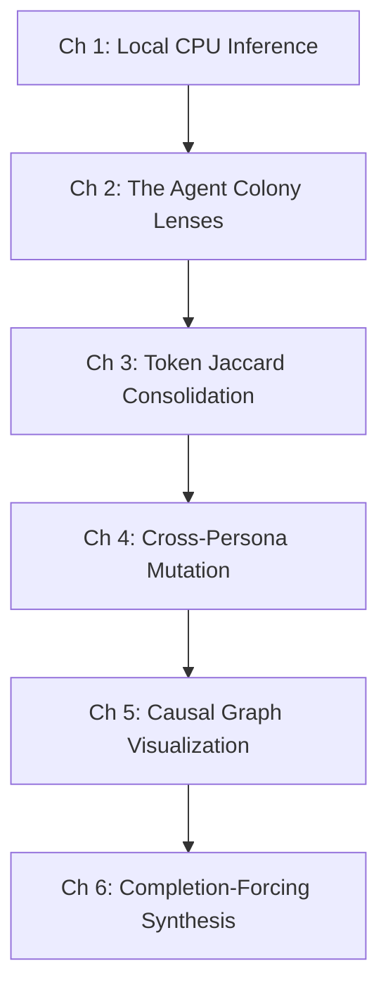

# Evolutionary Consequence Engine: Onboarding & Learning Curriculum

Welcome to the training curriculum for the **Parallel Reasoning Engine (TinyLlama Evolutionary Prototype)**. This curriculum is designed dual-track:
- **Carbon-based (Human Developers/AI Researchers)**: Focusing on conceptual design, mathematical modeling, and prompt structures.
- **Silicon-based (AI Coding Agents)**: Focusing on API contracts, JSON constraints, state variables, and execution rules.

---

## 🗺️ Curriculum Overview

---

## 📘 Chapter 1: Local CPU Inference & Syntax Recovery
*Mastering local execution under severe hardware bottlenecks.*

### 👨‍💻 Human Learning Track
- **Core Concept**: Small Language Models (1B parameters) suffer from severe context capacity limits (2K tokens) and high prompt evaluation latency on CPUs.
- **Key Knowledge**: 
  - Why sequential API queues stack request durations (forcing a transition to high HTTP read timeouts).
  - The limits of temperature settings ($0.2 - 0.3$) for keeping generation deterministic.
- **Reference**: Review Ollama's local parameters (`options: {"temperature": 0.3, "num_predict": 300}`).

### 🤖 Agent Onboarding Track
- **Core Directive**: Protect connections from timing out and handle raw text corruption.
- **Invariants**:
  - Always enforce client timeouts of $\ge 120.0s$ when querying local Ollama instances concurrently.
  - Implement a `json_repair` pipeline to gracefully sanitize incomplete or cut-off brackets without crashing.
- **Target File**: [engine.py](file:///d:/RES/experiments/parallel_reasoning_engine/engine.py#L18-L43) (`query_worker`).

---

## 📘 Chapter 2: The Colony Lenses & Keyword Selection
*Aligning agent prompts with style parameters instead of semantic domains.*

### 👨‍💻 Human Learning Track
- **Core Concept**: The Cognitive Style Axis. Avoid restricting agents to career domains (e.g. "finance", "medical"). Use general cognitive styles (`balanced`, `discovery`, `practical`, `contrarian`, `creative`) to prevent domain drift.
- **Key Knowledge**: How keyword selection matrices ($S_{align}$) evaluate and prune out-of-character nodes.

### 🤖 Agent Onboarding Track
- **Core Directive**: Enforce strict prompt schemas and filter generations programmatically.
- **Invariants**:
  - Do not use domain words in prompts; align exclusively with Style Matrix profiles from `config.json`.
  - Calculate alignment scores based on keyword list overlaps:
    - 0 matches $\implies 0.50$ (Pruned)
    - 1 match $\implies 0.75$ (Survives)
    - 2+ matches $\implies 1.00$ (Survives)
- **Target File**: [workers.py](file:///d:/RES/experiments/parallel_reasoning_engine/workers.py#L6-L23) and [engine.py](file:///d:/RES/experiments/parallel_reasoning_engine/engine.py#L45-L76).

---

## 📘 Chapter 3: Jaccard Consolidation & Graph Compression
*Reducing semantic density on CPU without vector databases.*

### 👨‍💻 Human Learning Track
- **Core Concept**: Set-based text tokenization and similarity mapping.
- **Mathematical Formula**: For tokenized keyword sets $Set_A$ and $Set_B$:
  $$J(A, B) = \frac{|Set_A \cap Set_B|}{|Set_A \cup Set_B|}$$
- **Key Knowledge**: Why we use a Jaccard threshold $\ge 0.75$ to group duplicates and how consensus accumulates points ($+0.2$ per merge).

### 🤖 Agent Onboarding Track
- **Core Directive**: Merge overlapping nodes while preserving data trails.
- **Invariants**:
  - Strip punctuation and stop-words before calculating overlaps.
  - When merging node $B$ into $A$, retain the longer rationale.
  - Append $B$'s `provenance` to $A$'s `provenance` array to record consensus.
- **Target File**: [consolidation.py](file:///d:/RES/experiments/parallel_reasoning_engine/consolidation.py).

---

## 📘 Chapter 4: Adversarial Cross-Persona Mutation
*Forcing opposing cognitive lenses to break semantic echo chambers.*

### 👨‍💻 Human Learning Track
- **Core Concept**: Cross-generational semantic evolution.
- **Key Knowledge**: The Opposing Mutator Matrix:
  - `financial_analyst` $\implies$ `contrarian_optimist` (Find upside of risk)
  - `contrarian_optimist` $\implies$ `worst_case_prepper` (Identify failure points)
  - `worst_case_prepper` $\implies$ `psychological_human_centric` (Assess human toll)
  - `psychological_human_centric` $\implies$ `financial_analyst` (Quantify financial friction)

### 🤖 Agent Onboarding Track
- **Core Directive**: Map parent-child associations and mark generations.
- **Invariants**:
  - Incremented child node generation: `generation = parent["generation"] + 1`.
  - Propagate ancestry: `provenance = parent_provenance + [f"mutator:{mutator_id}"]`.
  - Store ancestor linkage: `parent_id = parent["label"]`.
- **Target File**: [engine.py](file:///d:/RES/experiments/parallel_reasoning_engine/engine.py#L78-L135).

---

## 📘 Chapter 5: Causal Graph Visualization
*Mapping topological forests using offline interactive tools.*

### 👨‍💻 Human Learning Track
- **Core Concept**: Physics-based graph clustering and interactive visual dashboards.
- **Key Knowledge**: Visual encoding systems (Circles for G1, Diamonds for G2, Color mappings, sizes based on consensus).

### 🤖 Agent Onboarding Track
- **Core Directive**: Link nodes via parent IDs and lock viewport sizes.
- **Invariants**:
  - Draw directed edges from root to G1, and from parent label lookups to G2.
  - Constrain HTML layout CSS (`height: calc(100vh - 65px)` and `grid-template-rows: 100%`) to prevent Vis.js canvas infinite-expansion loops.
- **Target File**: [visualizer.py](file:///d:/RES/experiments/parallel_reasoning_engine/visualizer.py).

---

## 📘 Chapter 6: Completion-Forcing & Decision Synthesis
*Overcoming weak instruction-following capabilities in small models.*

### 👨‍💻 Human Learning Track
- **Core Concept**: Text completion steering. Instead of asking a small model to write under headers, end the prompt with the first header text to force completion.
- **Key Knowledge**: How to compress the graph pool to the top $N$ nodes before synthesis.

### 🤖 Agent Onboarding Track
- **Core Directive**: Programmatically inject the prompt suffix and parse outputs cleanly.
- **Invariants**:
  - Filter and sort by `consensus_score` desc, keeping the top 6 nodes.
  - End the prompt with the literal string `## 1. KEY STRATEGIC RATIONALE\n[Context Starter]`.
  - Intercept the generated text and package sections 2, 3, and 4 programmatically to guarantee formatting compliance.
- **Target File**: [synthesizer.py](file:///d:/RES/experiments/parallel_reasoning_engine/synthesizer.py).
